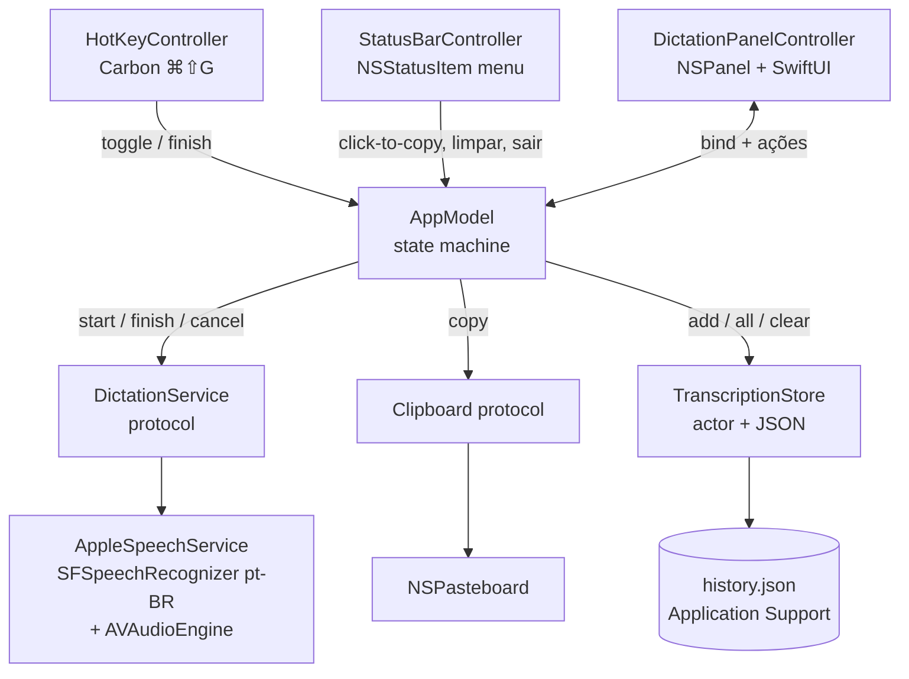

# OpenWhisper MVP Design

**Spec**: `.specs/features/openwhisper-mvp/spec.md`
**Status**: Approved (usuário confirmou SPM+Makefile e ⌘⇧G)

---

## Architecture Overview

App tray nativo Swift 6.3 (macOS 26, arm64), zero dependências de terceiros. Executável SPM empacotado em `.app` via Makefile (Info.plist com `LSUIElement`, ad-hoc codesign). Um `AppModel` (ObservableObject) é o orquestrador central com máquina de estados `idle → recording → transcribing`; todos os efeitos de sistema ficam atrás de protocolos (`DictationService`, `Clipboard`) para o núcleo ser 100% unit-testável via `swift test`.

Abordagens consideradas para build: XcodeGen + Xcode (conforto de GUI, depende de brew) e projeto .xcodeproj manual (pbxproj frágil via CLI). Escolhido **SPM + Makefile** — mais leve, alinhado ao requisito de leveza; UI via SwiftUI hospedado em NSPanel (padrão moderno para painéis flutuantes; AppKit puro rejeitado por verbosidade sem ganho aqui).



Fluxo principal: `⌘⇧G` → `AppModel.toggle()` → abre painel + `AppleSpeechService.start()` → partials atualizam a view → Finalizar (botão ou ⌘⇧G de novo) → `finish()` → texto final → `Clipboard.copy` → `TranscriptionStore.add` → painel fecha. Cancelar/Esc → `cancel()` → descarte total.

---

## Code Reuse Analysis

### Existing Components to Leverage

Greenfield — sem código existente. Reuso é 100% de frameworks do sistema:

| Framework | Uso |
| --------- | --- |
| Speech (`SFSpeechRecognizer`, `SFSpeechAudioBufferRecognitionRequest`) | Transcrição pt-BR, partials, on-device detection |
| AVFoundation (`AVAudioEngine`) | Capture tap do microfone → `append(_ buffer)` |
| Carbon (`RegisterEventHotKey`) | Atalho global ⌘⇧G (API C estável, funciona tray-only) |
| AppKit (`NSPanel`, `NSStatusItem`, `NSPasteboard`) | Painel flutuante, tray menu, clipboard |
| SwiftUI (`NSHostingView`) | Conteúdo do painel |

### Integration Points

| Sistema | Integração |
| ------- | ---------- |
| TCC (permissões) | `NSMicrophoneUsageDescription` + `NSSpeechRecognitionUsageDescription` no Info.plist; request em runtime no primeiro ditado |
| Application Support | `~/Library/Application Support/OpenWhisper/history.json` |

---

## Components

### AppModel

- **Purpose**: Orquestrador central; máquina de estados do ditado e regras de negócio (toggle, auto-copy, histórico).
- **Location**: `Sources/OpenWhisper/AppModel.swift`
- **Interfaces**:
  - `func toggle()` — idle→abre painel+grava; recording→finish (assumption confirmada); transcribing→ignora
  - `func finish()` — finaliza, copia, persiste, fecha; transcript vazio → mensagem, zero side effects
  - `func cancel()` — descarta tudo, fecha
  - `func copyToClipboard(_ text: String)` — usado pelo menu de histórico
  - `@Published var state: DictationState` — `.idle | .recording(startedAt: Date) | .transcribing | .failed(reason: FailureReason)`
  - `@Published var liveTranscript: String`
- **Dependencies**: `DictationService`, `Clipboard`, `TranscriptionStore`, callbacks de UI (painel fecha via estado)
- **Reuses**: nada (novo)

### DictationService (protocol) + AppleSpeechService

- **Purpose**: Abstrair transcrição de voz; implementação Apple Speech pt-BR.
- **Location**: `Sources/OpenWhisper/Speech/DictationService.swift`, `Sources/OpenWhisper/Speech/AppleSpeechService.swift`
- **Interfaces**:
  - `func start() async throws` — pede autorização (mic + speech), sobe `AVAudioEngine`, cria `SFSpeechAudioBufferRecognitionRequest`, emitindo partials
  - `var onPartial: ((String) -> Void)?`
  - `func finish() async -> String?` — para engine, retorna melhor transcript final; em erro de task, retorna partials acumulados (nil se nada)
  - `func cancel() async` — para engine e invalida task sem resultado
- **Dependencies**: Speech, AVFoundation; feature-detect `supportsOnDeviceRecognition` → se true, `requiresOnDeviceRecognition = true` (privacidade, sem rede); senão fallback server-based
- **Reuses**: nada (novo)

### TranscriptionStore

- **Purpose**: Histórico persistente (cap 50) com persistência JSON.
- **Location**: `Sources/OpenWhisper/TranscriptionStore.swift`
- **Interfaces**:
  - `func add(_ text: String) async` — insere no topo, trunca a 50, persiste
  - `func all() async -> [Transcription]` — mais recente primeiro
  - `func clear() async`
- **Dependencies**: `FileManager`, `Codable`; arquivo em Application Support (URL injetável para testes)
- **Reuses**: nada (novo)

### Clipboard (protocol) + NSPasteboardClipboard

- **Purpose**: Abstrair área de transferência para testes.
- **Location**: `Sources/OpenWhisper/Clipboard.swift`
- **Interfaces**: `func copy(_ text: String)`
- **Dependencies**: AppKit `NSPasteboard`

### DictationPanelController + DictationView

- **Purpose**: Painel flutuante acima de tudo, sem roubar foco.
- **Location**: `Sources/OpenWhisper/Panel/DictationPanelController.swift`, `Sources/OpenWhisper/Panel/DictationView.swift`
- **Interfaces**:
  - `func show()` / `func close()`
  - NSPanel: `.nonactivatingPanel`, `.borderless`, level `.floating`, `canJoinAllSpaces`; conteúdo SwiftUI lê `AppModel`
  - View: indicador de gravação + timer decorrido, live text (partials), botões **Finalizar** / **Cancelar**, Esc → cancelar; estados `.failed` → mensagem inline + botão "Abrir Ajustes" (perms negadas)
- **Dependencies**: AppModel (EnvironmentObject)
- **Reuses**: nada (novo)

### StatusBarController

- **Purpose**: Ícone + menu do tray com histórico click-to-copy.
- **Location**: `Sources/OpenWhisper/StatusBar/StatusBarController.swift`, `Sources/OpenWhisper/StatusBar/HistoryMenuBuilder.swift`
- **Interfaces**:
  - `func refresh(menu items: [NSMenuItem])` — reconstrói a partir do store
  - `HistoryMenuBuilder.build(entries:, actions:) -> [NSMenuItem]` — **lógica pura testável**: label truncado a 60 chars (tooltip = texto completo), mais recente primeiro, estado vazio → item desabilitado "Sem transcrições"; itens fixos: Limpar histórico, Sair
- **Dependencies**: `NSStatusItem`, `TranscriptionStore`, `AppModel`
- **Reuses**: nada (novo)

### HotKeyController

- **Purpose**: Registro do atalho global ⌘⇧G via Carbon.
- **Location**: `Sources/OpenWhisper/HotKeyController.swift`
- **Interfaces**: `init(keyCode: UInt32, modifiers: UInt32, handler: () -> Void)`; `start()` / `stop()`
- **Dependencies**: Carbon HIToolbox
- **Reuses**: nada (novo)

### AppDelegate (composition root)

- **Purpose**: Montar e conectar todos os componentes; ciclo de vida.
- **Location**: `Sources/OpenWhisper/AppDelegate.swift`, `Sources/OpenWhisper/main.swift`
- **Dependencies**: todos acima

---

## Data Models

### Transcription

```swift
struct Transcription: Codable, Identifiable, Equatable {
    let id: UUID
    let text: String
    let createdAt: Date
}
```

**Relationships**: único modelo; armazenado como array JSON em `~/Library/Application Support/OpenWhisper/history.json`, mais recente primeiro.

### DictationState

```swift
enum DictationState {
    case idle
    case recording(startedAt: Date)
    case transcribing
    case failed(FailureReason) // .permissionDenied, .recognitionUnavailable, .engineError
}
```

---

## Error Handling Strategy

| Error Scenario | Handling | User Impact |
| -------------- | -------- | ----------- |
| Permissão de mic/speech negada | Estado `.failed(.permissionDenied)` | Painel mostra erro + botão "Abrir Ajustes" |
| Reconhecimento indisponível (pt-BR) | `.failed(.recognitionUnavailable)` | Mensagem inline, painel fecha após ok, nada copiado |
| Task de reconhecimento falha no meio | `finish()` retorna partials acumulados | Texto parcial é copiado (graceful) |
| Transcript final vazio (silêncio) | `.failed` leve com msg "Nenhuma fala detectada" | Painel mostra mensagem; zero side effects (OW-06) |
| Dispositivo de áudio some / sleep | Tap do engine encerra → trata como `finish()` | Entrega o que foi transcrito até ali |
| Falha ao persistir JSON | Log via `os.Logger`, mantém em memória | Histórico funciona na sessão; erro só em Console |

---

## Risks & Concerns

| Concern | Location | Impact | Mitigation |
| ------- | -------- | ------ | ---------- |
| ⌘⇧G conflita com "Ir para a Pasta" (Finder/diálogos) | Sistema | Atalho nativo deixa de funcionar globalmente | Usuário aceitou explicitamente; OW-12 (atalho configurável, P2) resolve |
| pt-BR pode não ter on-device recognition nesta máquina | runtime | Cai para server-based: exige internet; tasks server têm limite ~1 min de áudio | Feature-detect em runtime; em server-based com task erro por duração, `finish()` entrega partials acumulados |
| Ad-hoc signing + TCC: rebuild pode invalidar grants de permissão | Makefile/sign | Prompts de permissão reaparecem | Bundle ID estável `br.marcos.openwhisper`; docs com `tccutil reset` como fallback |
| Carbon hotkey é API C legada, mas sem alternativa first-party para hotkey global consumível | HotKeyController | Risco baixo de deprecação comportamental | Isolado num único componente com interface própria |
| Smoke test de voz/mic não roda em teste automatizado | AppleSpeechService | Cobertura dessa camada depende de UAT manual | Checklist manual por AC no T8/T9 + sensor de discriminação via testes de unidade do AppModel com mocks |

---

## Tech Decisions (only non-obvious ones)

| Decision | Choice | Rationale |
| -------- | ------ | --------- |
| Build system | SPM + Makefile (bundle .app manual + ad-hoc codesign) | Zero deps, mais leve; usuário confirmou |
| Atalho global | Carbon `RegisterEventHotKey` ⌘⇧G | Única API first-party que consome o evento globalmente; conflito Finder aceito |
| On-device speech | Feature-detect `supportsOnDeviceRecognition`; se true, força on-device | Privacidade + sem limite de ~1 min do server-based; fallback transparente |
| Testes | Swift Testing (`import Testing`) via `swift test` | Swift 6.3 nativo, sem XCTest boilerplate |
| Estado do painel | Um único `AppModel` ObservableObject, UI lê `@Published` | Núcleo testável sem UI; painel e tray são views descartáveis |
| Persistência | JSON + Codable em Application Support, URL injetável | Leve para 50 itens; injetável = testável sem disco real |
